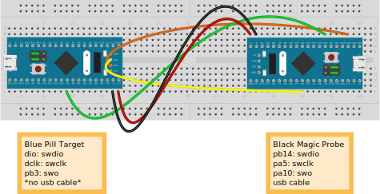

# Connecting Black Magic Probe and Blue Pill

| Target|Probe|signal|
|---|---|---|
|DIO|PB14|swdio|
|DCLK|PA5|swclk|
|PB3|PA10|swo|
|No usb cable|usb cable|

Do not connect two power sources to a Blue Pill at the same time.

usb cable from bmp to host running gdb.

